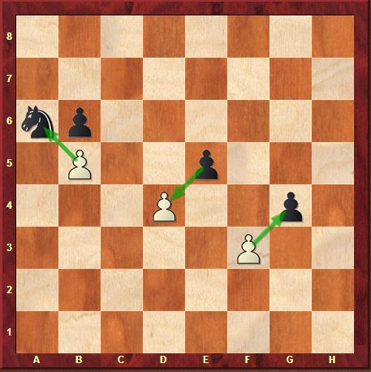
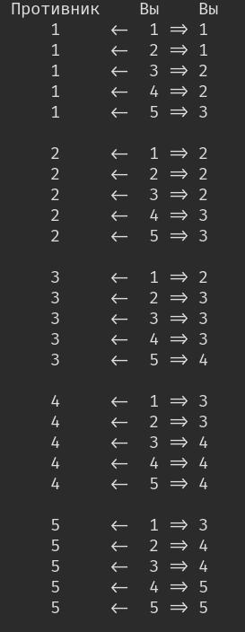

# Документация
## Состав команды

Камкин Илья - проектировщик

Стебенев Павел - разработчик

Шишкина Алина - разработчик

Дадонов Александр - тестировщик

Беляев Максим - тестировщик

## Основные правила

Игра происходит на доске, поделённой на равные квадратные клетки, или поля. Размер доски — 8×8 клеток. Вертикальные ряды полей (вертикали) обозначаются латинскими буквами от а до h слева направо, горизонтальные ряды (горизонтали) — цифрами от 1 до 8 снизу вверх; каждое поле обозначается сочетанием соответствующих буквы и цифры. Поля раскрашены в тёмный и светлый цвета (и называются, соответственно, чёрными и белыми) так, что соседние по вертикали и горизонтали поля раскрашены в разные цвета. Доска располагается так, чтобы ближнее угловое поле справа от игрока было белым (для белых это поле h1, для чёрных — поле а8).

У игроков в начале игры имеется по одинаковому набору фигур. Фигуры одного из игроков условно называются «белыми», другого — «чёрными». Белые фигуры окрашены в светлый цвет, чёрные — в тёмный. Сами игроки называются «белые» и «чёрные» по цвету своих фигур.

Игра заключается в том, что игроки поочерёдно делают ходы. Первый ход делают белые.

### Типы фигур и их вес

1. [Король](#король) (♔, ♚) 
2. [Ферзь](#ферзь) (♕, ♛) Вес: 5
3. [Слон](#слон) (♗, ♝) Вес: 4
4. [Ладья](#ладья) (♖, ♜) Вес: 3
5. [Конь](#конь) (♘, ♞) Вес: 2
6. [Пешка](#пешка) (♙, ♟) Вес: 1

### Ходы

- Фигуры (кроме [коня](#конь)) передвигаются по прямой линии, при этом все промежуточные поля между начальным и конечным должны быть свободны (на них не должно быть своих или чужих фигур). Исключением является ход [коня](#конь).
- Ход на поле, занятое своей фигурой, невозможен.
- При ходе на поле, занятое чужой фигурой происходит [атака](#атака).

#### Король

#### Ферзь

#### Слон

#### Ладья

#### Конь

#### Пешка

Ходы пешки:

Взятие пешкой фигур противника:

#### Атака

При ходе на поле, занятое чужой фигурой сравнивается [вес фигур](#типы-фигур-и-их-вес).
Вес Вашей фигуры расчитывается следующим образом:  
{Вес Вашей фигуры} - математическое_округление[({Вес Вашей фигуры} - {Вес фигуры противника}) / 2]  

Следовательно выгоднее бить более слабыми фигурами более сильные фигуры.  
Ниже преведены все изменения веса Вашей фигуры при атаке фигур противника:  

Данные правила пременимы ко всем фигурам, кроме короля. Если Ваш король находится под зоной хода фигуры противника вы должны сделать ход в такую клетку, в которой король не находится под зоной атаки фигуры противника. Если Вы не можете сделать такого хода - Вы проиграли.

#### Стартовый состав армии

- 1 Король
- 1 Ферзь
- 2 Слона
- 2 Ладьи
- 2 Коня
- 8 Пешек

## Описание проекта

Проект представляет собой Desktop-приложение (игра по мативам Шахмат) написанное на языке программирования C++ с использованием фреймворка QT. 

Проект подразумевает возможности: 

1. Одновременной игры двух пользователей.
   
   Два пользователя могут вести игру друг с другом сидя за одним компьютером.

3. Оценки позиции игроков в реальном времени.
   
   Во время партии каждый из игроков может получить оценку своего шанса на победу, которая рассчитывается с учетом позиции фигур на игровом поле.

4. Ведения таблицы лидеров.
   
   Перед началом партии игрокам будет предложено ввести свои имена для таблицы лидеров.

---
## Классы

Ссылка на doxygen

